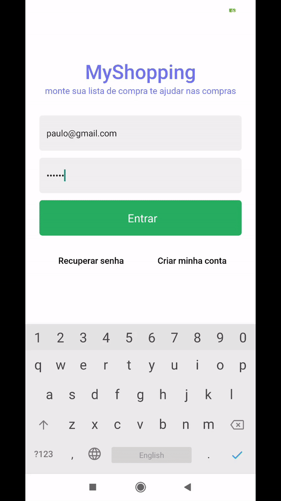

<h1 align="center">🛒 My Shopping App</h1>

<p align="center">
  

  

  <a href="https://github.com/paulocf92/rs-myshopping/commits/main">
    
  </a>

  
   <a href="https://github.com/paulocf92/rs-myshopping/stargazers">
    
  </a>
</p>

Manage your products and receipt snapshots with ease.

<p align="center"></p>

# 🚀 About the project

**My Shopping** is a study app that focus on offering CRUD operations for a list of products and managing pictures in a outside source. All of the operations, both database and storage, are held on Firebase.

Main technologies used:

- ⭐ React Native
- ⭐ Firebase (BaaS)
  - Firestore
  - Storage
  - Authentication

Additional libs:

- Styled Components

# ⚙️ Installing and Running

Install dependencies, make sure Firebase is correctly set up for the project and start React Native environment.

```bash
# install dependencies
$ yarn install

# set up your app to work with firebase's firestore, storage and authentication

# run react native bundler
$ yarn start

# run app on the device
$ yarn android
# or
$ yarn ios
```

## 📝 License

This project is under MIT license.

Made with ❤️ by [Paulo Filho](https://www.linkedin.com/in/paulocf92/)! 😊
